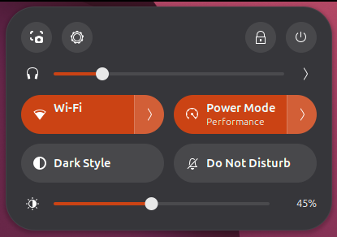

# DDC Brightness

**A brightness slider for external monitors, right in GNOME Quick Settings.**

[ภาษาไทย](README.th.md)



Laptops get a brightness slider for free; desktop monitors don't. This GNOME Shell
extension adds one for any monitor that supports **DDC/CI**, using
[`ddcutil`](https://www.ddcutil.com/) under the hood (the same backend as `ddcui`).

## Features

- **Native look** – a regular Quick Settings slider, next to volume.
- **Smooth dragging** – the slider follows the pointer freely; brightness is applied in
  5% steps so a slow DDC/CI bus can keep up.
- **Never blocks the shell** – all monitor I/O runs in a small helper process, so the
  compositor never forks or waits on I²C.
- **Multiple monitors** – the main slider moves all monitors together; the `›` menu
  adjusts each one separately.
- **Shows the real value** – the percentage label is what the monitor actually received.
- **Manual re-sync** – changed brightness with the monitor's own buttons? Click the ☀ icon.

## Requirements

| | |
|---|---|
| GNOME Shell | 50 (tested on Ubuntu 26.04) |
| `ddcutil` | 2.x |
| Monitor | DDC/CI enabled in its on-screen menu |
| Permissions | read/write access to `/dev/i2c-*` |

Set up `ddcutil` once:

```bash
sudo apt install ddcutil
```

```bash
sudo usermod -aG i2c $USER
```

```bash
echo i2c-dev | sudo tee /etc/modules-load.d/i2c-dev.conf
```

Then log out and back in (or reboot). Check that your monitor is detected:

```bash
ddcutil detect
```

## Installation

### From source

```bash
git clone https://github.com/Genexiz/DisplayBrightnessController_Gnome.git
```

```bash
cd DisplayBrightnessController_Gnome && make install
```

On **Wayland**, log out and back in so GNOME Shell picks up the new extension, then:

```bash
make enable
```

Open Quick Settings (top-right corner) — the ☀ slider is below the toggles.

### From a release zip

Download `ddc-brightness@genexiz.shell-extension.zip` and run:

```bash
gnome-extensions install --force ddc-brightness@genexiz.shell-extension.zip
```

Log out and back in, then enable it:

```bash
gnome-extensions enable ddc-brightness@genexiz
```

### Uninstall

```bash
make uninstall
```

## How it works

```
Quick Settings slider (GJS, inside gnome-shell)
   │  writes one line per change to a pipe — no fork, no waiting
   │    stdin:  detect | get <bus> | set <bus> <value>
   ▼    stdout: display <bus> <name> | detected | value <bus> <cur> <max>
ddc-helper.py  (one long-running process, started with the extension)
   │  drains queued requests; only the latest "set" per monitor is applied
   ▼
ddcutil --bus N setvcp 10 <value>   ──I²C──▶  monitor (VCP 0x10 = brightness)
```

Design notes:

- **No forking from gnome-shell.** Spawning a process from the compositor stalls
  its frame loop. The extension starts the helper once; after that it only writes
  to a pipe.
- **Coalesced writes.** DDC/CI handles only a few writes per second. While a write
  is in progress new values pile up, and only the newest is sent.
- **Step quantisation.** The slider is continuous, but values are rounded to 5%
  steps before being sent (at most 20 writes across the whole range).
- **Minimal bus traffic.** On some GPU drivers (seen with NVIDIA) any DDC/CI
  transaction makes the mouse cursor stutter, so the monitor is only read at
  startup and when you click the icon — not every time Quick Settings opens.
- **No snapping back.** Like GNOME's volume slider, a slider under the pointer is
  never moved by a late reading, and readings older than the last write are dropped.

## Configuration

Tunables are constants at the top of
[`ddc-brightness@genexiz/extension.js`](ddc-brightness@genexiz/extension.js):

| Constant | Default | Meaning |
|---|---|---|
| `STEP_PERCENT` | `5` | Brightness step sent to the monitor. Larger = fewer writes, brightness follows the pointer more closely; smaller = finer control. |

`ddcutil` speed flags are in
[`ddc-helper.py`](ddc-brightness@genexiz/ddc-helper.py) (`FAST`). If a write fails
with them, the helper automatically retries with default timings.

## Troubleshooting

**The slider doesn't appear.** It is hidden when no DDC/CI monitor is found. Run
`ddcutil detect`. If it reports a permission error, check that you're in the `i2c`
group. If it reports an invalid display, enable DDC/CI in the monitor's menu.

**Logs:**

```bash
journalctl --user -f -o cat /usr/bin/gnome-shell | grep -i ddc
```

**Brightness changed with the monitor's buttons and the slider is out of date.**
Click the ☀ icon to re-read it.

## Development

```bash
make link     # symlink this checkout into ~/.local/share/gnome-shell/extensions
make check    # syntax-check extension.js, ddc-helper.py and metadata.json
make pack     # build dist/ddc-brightness@genexiz.shell-extension.zip
```

On Wayland, code changes are loaded only after logging out and back in. For
faster iteration, run a nested shell:

```bash
dbus-run-session gnome-shell --devkit --wayland
```

(`--devkit` needs the `mutter-dev-bin` package on Ubuntu.)

### Project layout

```
ddc-brightness@genexiz/   the extension (folder name = UUID)
├── extension.js          Quick Settings UI + helper process management
├── ddc-helper.py         long-running ddcutil worker (Python 3, stdlib only)
├── metadata.json
└── stylesheet.css
docs/                     README assets
Makefile                  install / pack / check targets
```

## Contributing

Issues and pull requests are welcome. Reports from other GNOME versions, GPUs and
monitors are especially useful. Please include the output of `ddcutil detect` and
`gnome-shell --version`.

## License

[GPL-2.0-or-later](LICENSE), the same license as GNOME Shell.
